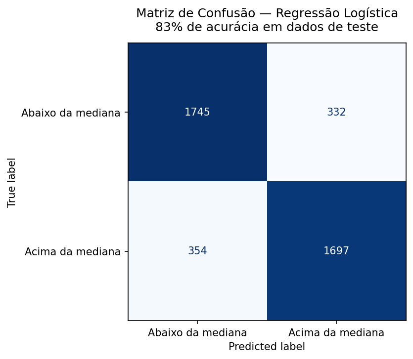
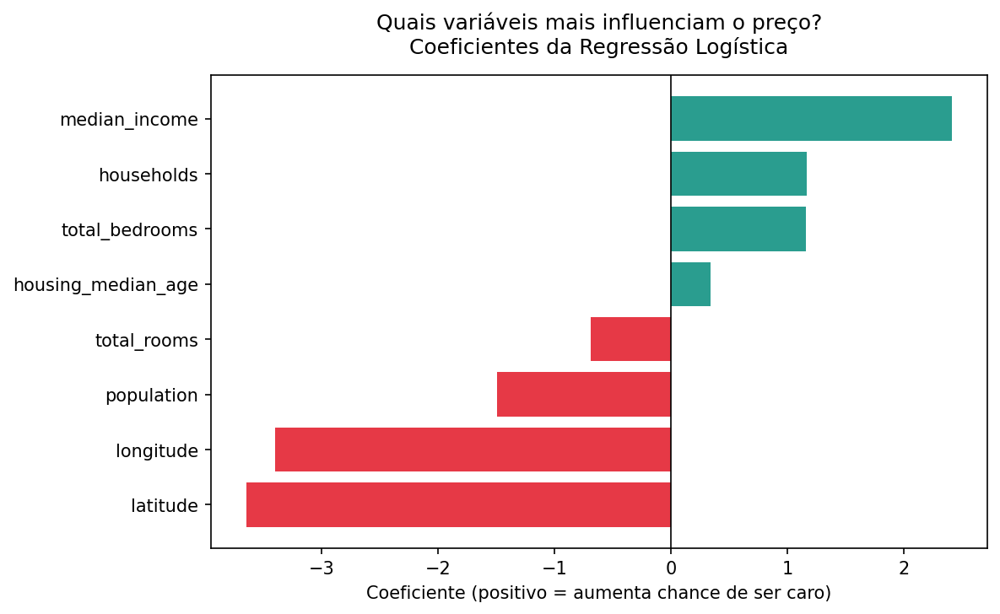
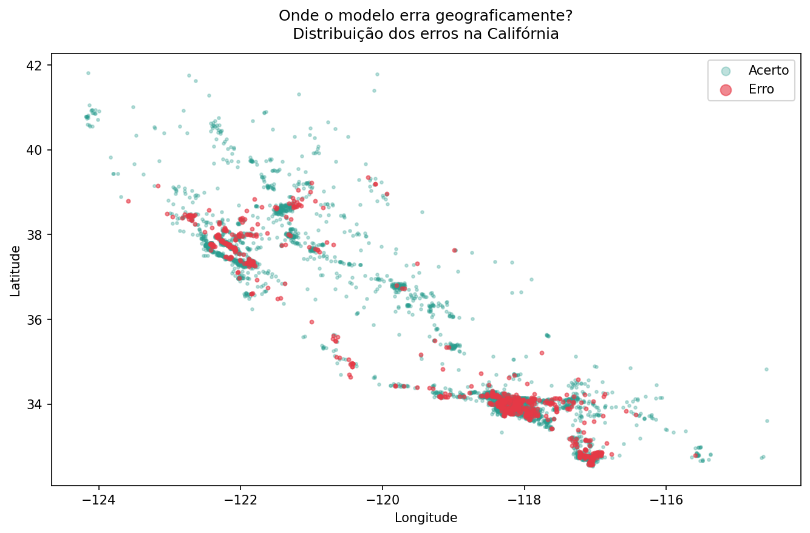

# Classificação de Imóveis por Faixa de Preço
**Regressão Logística aplicada ao California Housing Dataset**

## Problema de negócio

Dado um conjunto de características de um bloco residencial na Califórnia — renda média, localização, densidade populacional — é possível prever se os imóveis daquele bloco estão acima ou abaixo da mediana de preços do mercado?

Essa pergunta tem aplicação direta em precificação, triagem de leads e análise de risco em crédito imobiliário.

## Abordagem

- **Tipo de problema:** Classificação binária
- **Variável alvo:** `caro` — 1 se `median_house_value` > mediana geral (US$ 179.700), 0 caso contrário
- **Algoritmo:** Regressão Logística (scikit-learn)
- **Divisão:** 80% treino / 20% teste com `random_state=42`
- **Pré-processamento:** imputação de nulos com mediana, escalonamento com StandardScaler

## Resultado

| Métrica | Valor |
|---|---|
| Acurácia | 83% |
| Precision (caro) | 84% |
| Recall (caro) | 83% |
| F1-score (caro) | 0.83 |

## Visualizações





## Principal descoberta

`median_income` é a variável com maior poder preditivo — coeficiente de +2.5, muito acima das demais. Renda do bairro prediz preço imobiliário melhor do que localização geográfica ou tamanho do imóvel.

O modelo erra mais na região de Los Angeles (latitude ~34, longitude ~-118), onde a heterogeneidade espacial é alta — bairros com perfis de preço radicalmente diferentes estão próximos geograficamente.

## Limitação conhecida

`ocean_proximity` foi excluída nesta versão por ser variável categórica. Incluí-la com encoding adequado é o próximo passo natural para ganho de performance.

## Estrutura do projeto
```
├── 01_exploracao.py
├── 02_modelo.py
├── 03_visualizacoes.py
├── grafico1_matriz_confusao.png
├── grafico2_coeficientes.png
├── grafico3_erros_geograficos.png
└── README.md
```

## Reprodução
```bash
pip install scikit-learn pandas matplotlib
python 01_exploracao.py
python 02_modelo.py
python 03_visualizacoes.py
```

## Autor

**Gabriel Ferreira dos Santos**  
[LinkedIn](https://www.linkedin.com/in/eugabrielferreira) · [GitHub](https://github.com/eugabrielferreira)
